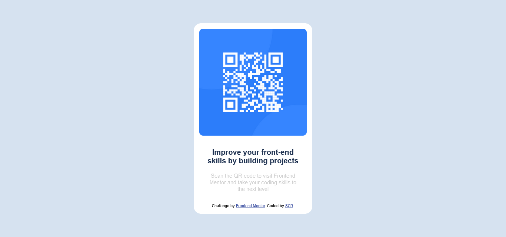

# Frontend Mentor - QR code component solution

This is a solution to the [QR code component challenge on Frontend Mentor](https://www.frontendmentor.io/challenges/qr-code-component-iux_sIO_H). Frontend Mentor challenges help you improve your coding skills by building realistic projects. 

## Table of contents

- [Overview](#overview)
  - [Screenshot](#screenshot)
  - [Links](#links)
- [My process](#my-process)
  - [Built with](#built-with)
  - [What I learned](#what-i-learned)
- [Author](#author)


## Overview
This is a solution to the [QR code component challenge on Frontend Mentor](https://www.frontendmentor.io/challenges/qr-code-component-iux_sIO_H). Frontend Mentor challenges help you improve your coding skills by building realistic projects. 

### Screenshot




### Links

- Solution URL: [Add solution URL here](https://github.com/scr-dev/QRcode)
- Live Site URL: [Add live site URL here](https://scr-dev.github.io/QRcode/)


### Built with

- Semantic HTML5 markup
- CSS custom properties
- Flexbox- 
- Mobile-first workflow

### What I learned

With this challenge I was able to review my knowledge of the css flexbox property, alignments of elements to the center of the screen, and the use of hsl colors.

```html
  <div class="container">
    <div class="qr__app">
        <div class="div-interna_qr">
          
          <h1>Improve your front-end<br>skills by building projects</h1>
    
        <p class="description">
          Scan the QR code to visit Frontend<br>Mentor and take your coding skills to<br>the next level
        </p>
        
        <div class="attribution">
          Challenge by <a href="https://www.frontendmentor.io?ref=challenge" target="_blank">Frontend Mentor</a>. 
          Coded by <a href="https://github.com/scr-dev" target="_blank">SCR</a>.
        </div>
        </div>
    </div>
  </div> 
```
```css
.proud-of-this-css {
  :root {
    --White: hsl(0, 0%, 100%);
    --Light-gray: hsl(212, 45%, 89%);
    --Grayish-blue: hsl(220, 15%, 55%);
    --Dark-blue: hsl(218, 44%, 22%);
}

body{
    font-family: 'Noto Sans', sans-serif;
    font-family: 'Outfit', sans-serif;
}

.container {
    
    width: 100vw;
    height: 100vh;    
    display: flex;
    justify-content: center;
    align-items: center;    
    background-color: var(--Light-gray);   
    
}

.qr__app {   
    border-radius: 20px;
    display: flex;
    flex-direction: column;
    justify-content: center;
    align-items: center;
    background-color: var(--White);
   
}
}
```

## Author

- Website - [Sidnei Rodrigues](https://github.com/scr-dev)
- Frontend Mentor - [@scr-dev](https://www.frontendmentor.io/profile/scr-dev)
- Twitter - [@scrsidnei](https://twitter.com/scrsidnei)


